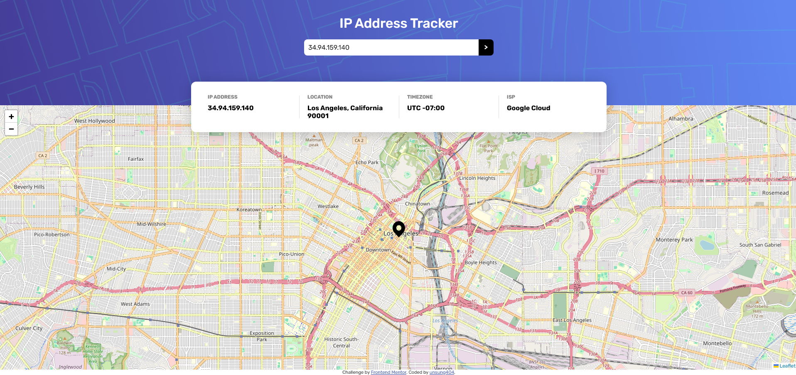

# Frontend Mentor - IP Address Tracker

This is my solution to the [IP Address Tracker challenge](https://www.frontendmentor.io/challenges/ip-address-tracker-I8-0yYAH0) on Frontend Mentor. The goal was to build a web app where users can input an IP address or domain and see its location and related info displayed on an interactive map.

---

## 📋 Table of Contents

- [Overview](#overview)
- [Screenshot](#screenshot)
- [Links](#links)
- [Built With](#built-with)
- [What I Learned](#what-i-learned)
- [Future Improvements](#future-improvements)
- [Author](#author)

---

## 🧭 Overview

**Users should be able to:**

- View their own IP address and location on initial load
- Enter an IP address or domain name and get the corresponding location details
- See the interactive location on the map
- View a responsive layout on all screen sizes

---

## 📷 Screenshot




---

## 🔗 Links

- Solution: [My Frontend Mentor Submission](https://www.frontendmentor.io/solutions/your-solution-link)
- Live Site: [Live Demo](https://your-username.github.io/ip-address-tracker/)

---

## 🛠 Built With

- Semantic HTML5
- CSS (Flexbox, Media Queries)
- JavaScript (Vanilla JS)
- [Leaflet.js](https://leafletjs.com/) – for interactive maps
- [Geo.IPify API](https://geo.ipify.org/) – for geolocation data
- Mobile-first responsive design

---

## 🌱 What I Learned

This was my first time using **Leaflet.js** and working with an external API like **IPify**. I learned how to:

- Fetch data asynchronously using `fetch()`
- Parse and update the DOM with JavaScript
- Dynamically update a map with custom markers
- Make a responsive layout that adapts to mobile screens

Here’s an example of the dynamic map update logic:
```js
const customIcon = L.icon({
  iconUrl: 'images/icon-location.svg',
  iconSize: [30, 40],
  iconAnchor: [15, 40]
});

marker = L.marker([lat, lng], { icon: customIcon }).addTo(map);
